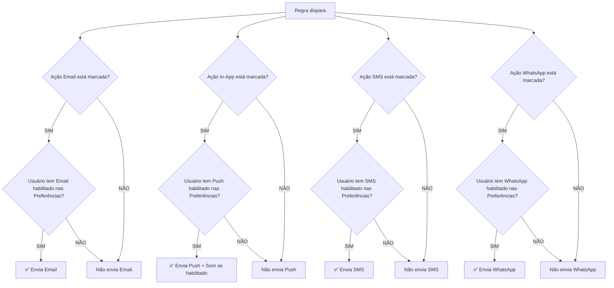

# 📊 FASE 6: Análise do Sistema de Alertas e Regras

## 🎯 Objetivos da Fase 6

```python
# Models Backend:
- [ ] Rule (name, condition, action, enabled)
- [ ] Alert (rule_id, triggered_at, resolved_at)

# Features:
- [ ] Threshold alerts (temperatura > X)
- [ ] Email notifications
- [ ] Alert history
- [ ] Acknowledge alerts
```

---

## 📋 Análise da Estrutura Atual

### ✅ O que já está implementado (Frontend):

#### 1. **AlertsPage.tsx**
- ✅ Lista de alertas com filtros (Ativos, Reconhecidos, Resolvidos, Todos)
- ✅ Estatísticas de alertas (Ativos, Reconhecidos, Resolvidos, Total)
- ✅ Botões "Reconhecer" e "Resolver" alertas
- ✅ Severidade dos alertas (Crítico, Alto, Médio, Baixo) com cores
- ✅ Histórico visual de alertas

#### 2. **PreferencesDialog.tsx**
**Canais de Notificação Atuais:**
- ✅ Email
- ✅ Push (navegador e aplicativo)
- ✅ Som

**Alertas por Severidade:**
- ✅ Crítico
- ✅ Alto
- ✅ Médio
- ✅ Baixo

#### 3. **AddRuleModal.tsx**
**Configuração de Regras:**
- ✅ Seleção de equipamento
- ✅ Seleção de parâmetro IoT
- ✅ Operadores de comparação (>, >=, <, <=, ==, !=)
- ✅ Valor limite (threshold)
- ✅ Duração (minutos)
- ✅ Severidade (Crítico, Alto, Médio, Baixo)

**Ações ao Disparar:**
- ✅ Email
- ✅ Notificação In-App
- ❌ Webhook (descontinuado)

---

## 🔍 Análise: Conflito entre Preferências e Ações ao Disparar

### Pergunta Chave:
> "No final do modal adicionar regras existe a opção de ações ao disparar, porém essa funcionalidade entra em conflito ou não com as preferências do usuário?"

### 📊 Comparação:

| Aspecto | **Preferências do Usuário** | **Ações ao Disparar (Regra)** |
|---------|----------------------------|-------------------------------|
| **Escopo** | Global para o usuário | Específico da regra |
| **Objetivo** | Define **COMO** o usuário quer receber notificações | Define **O QUE** acontece quando a regra dispara |
| **Canais** | Email, Push, Som, SMS, WhatsApp | Email, In-App |
| **Controle** | Usuário decide onde receber | Criador da regra decide qual ação tomar |

---

## 💡 Recomendação: **MANTER AMBOS** com Lógica Hierárquica

### ✅ Por que manter as duas funcionalidades:

#### 1. **Ações ao Disparar (Regra)** = O QUE acontece
Define quais **sistemas** devem ser acionados quando a regra dispara:
- **Email**: Envia email para os responsáveis
- **In-App**: Cria notificação na plataforma
- **SMS**: Envia SMS (novo)
- **WhatsApp**: Envia mensagem (novo)

#### 2. **Preferências do Usuário** = COMO o usuário recebe
Define **como** cada usuário individual quer ser notificado:
- **Email habilitado**: Recebe emails se a regra tiver ação Email
- **Push habilitado**: Recebe push notifications se a regra tiver ação In-App
- **Som habilitado**: Toca som quando notificação chegar
- **SMS habilitado**: Recebe SMS se a regra tiver ação SMS
- **WhatsApp habilitado**: Recebe WhatsApp se a regra tiver ação WhatsApp

---

## 🎯 Lógica de Funcionamento Proposta

### Fluxo de Decisão:



### Exemplo Prático:

**Cenário 1: Temperatura Alta no Chiller**

**Regra configurada:**
- Nome: "Temperatura Alta - Chiller Central"
- Condição: Temperatura > 80°C por 5 min
- Severidade: Crítico
- **Ações ao Disparar**: ✅ Email, ✅ In-App, ✅ SMS, ✅ WhatsApp

**Usuário A (Admin) - Preferências:**
- ✅ Email
- ✅ Push
- ✅ Som
- ✅ SMS
- ✅ WhatsApp

**→ Resultado:** Recebe Email + Push (com som) + SMS + WhatsApp

**Usuário B (Operador) - Preferências:**
- ✅ Email
- ❌ Push
- ❌ Som
- ❌ SMS
- ❌ WhatsApp

**→ Resultado:** Recebe APENAS Email

---

## 🛠️ Implementação Recomendada

### 1. **Adicionar novos canais no PreferencesDialog.tsx**

```tsx
// Novos canais a adicionar:
- SMS (ícone: MessageSquare)
- WhatsApp (ícone: MessageCircle)
```

### 2. **Adicionar novos canais no AddRuleModal.tsx**

```tsx
// Atualizar AVAILABLE_ACTIONS em /types/rule.ts:
export const AVAILABLE_ACTIONS = [
  { value: 'EMAIL', label: 'Enviar E-mail' },
  { value: 'IN_APP', label: 'Notificação In-app' },
  { value: 'SMS', label: 'Enviar SMS' },        // NOVO
  { value: 'WHATSAPP', label: 'Enviar WhatsApp' }, // NOVO
];
```

### 3. **Backend: Validação de Notificações**

```python
# apps/alerts/services.py

def send_alert_notifications(alert, rule):
    """
    Envia notificações baseado nas ações da regra E nas preferências do usuário
    """
    for user in get_notifiable_users(alert):
        preferences = user.notification_preferences
        
        # Email
        if 'EMAIL' in rule.actions and preferences.email_enabled:
            send_email_notification(user, alert)
        
        # In-App (Push)
        if 'IN_APP' in rule.actions and preferences.push_enabled:
            send_push_notification(user, alert)
            if preferences.sound_enabled:
                include_sound_in_push(user, alert)
        
        # SMS (NOVO)
        if 'SMS' in rule.actions and preferences.sms_enabled:
            send_sms_notification(user, alert)
        
        # WhatsApp (NOVO)
        if 'WHATSAPP' in rule.actions and preferences.whatsapp_enabled:
            send_whatsapp_notification(user, alert)
```

---

## 📊 Alterações Necessárias

### Frontend:

#### ✅ Arquivo 1: `src/components/auth/PreferencesDialog.tsx`
**Adicionar:**
- Canal SMS com toggle
- Canal WhatsApp com toggle
- Ícones: `MessageSquare`, `MessageCircle` do lucide-react

#### ✅ Arquivo 2: `src/types/rule.ts`
**Atualizar:**
```typescript
export const AVAILABLE_ACTIONS = [
  { value: 'EMAIL', label: 'Enviar E-mail' },
  { value: 'IN_APP', label: 'Notificação In-app' },
  { value: 'SMS', label: 'Enviar SMS' },
  { value: 'WHATSAPP', label: 'Enviar WhatsApp' },
];

export type RuleAction = 'EMAIL' | 'IN_APP' | 'SMS' | 'WHATSAPP';
```

#### ✅ Arquivo 3: `src/store/auth.ts`
**Atualizar User type:**
```typescript
interface User {
  // ... campos existentes
  notification_preferences?: {
    email_enabled: boolean;
    push_enabled: boolean;
    sound_enabled: boolean;
    sms_enabled: boolean;      // NOVO
    whatsapp_enabled: boolean; // NOVO
  };
}
```

### Backend:

#### ✅ Model: `apps/accounts/models.py`
**Adicionar campos ao User ou criar NotificationPreferences:**
```python
class NotificationPreferences(models.Model):
    user = models.OneToOneField(User, on_delete=models.CASCADE, related_name='notification_prefs')
    
    # Canais
    email_enabled = models.BooleanField(default=True)
    push_enabled = models.BooleanField(default=True)
    sound_enabled = models.BooleanField(default=True)
    sms_enabled = models.BooleanField(default=False)      # NOVO
    whatsapp_enabled = models.BooleanField(default=False) # NOVO
    
    # Severidades
    critical_alerts = models.BooleanField(default=True)
    high_alerts = models.BooleanField(default=True)
    medium_alerts = models.BooleanField(default=True)
    low_alerts = models.BooleanField(default=False)
    
    # Telefones
    phone_number = models.CharField(max_length=20, blank=True, null=True)      # Para SMS
    whatsapp_number = models.CharField(max_length=20, blank=True, null=True)   # Para WhatsApp
```

#### ✅ Model: `apps/alerts/models.py`
```python
class Rule(TenantAwareModel):
    name = models.CharField(max_length=200)
    description = models.TextField(blank=True)
    
    # Condição
    equipment = models.ForeignKey('assets.Asset', on_delete=models.CASCADE)
    parameter_key = models.CharField(max_length=100)
    operator = models.CharField(max_length=10, choices=[...])
    threshold = models.FloatField()
    duration = models.IntegerField(default=5)  # minutos
    
    # Severidade
    severity = models.CharField(max_length=20, choices=[...])
    
    # Ações (JSONField para múltiplas ações)
    actions = models.JSONField(default=list)  # ['EMAIL', 'IN_APP', 'SMS', 'WHATSAPP']
    
    # Estado
    enabled = models.BooleanField(default=True)
    
    created_at = models.DateTimeField(auto_now_add=True)
    updated_at = models.DateTimeField(auto_now=True)

class Alert(TenantAwareModel):
    rule = models.ForeignKey(Rule, on_delete=models.CASCADE)
    
    # Estado
    triggered_at = models.DateTimeField(auto_now_add=True)
    acknowledged_at = models.DateTimeField(null=True, blank=True)
    acknowledged_by = models.ForeignKey(User, null=True, blank=True, related_name='acknowledged_alerts')
    resolved_at = models.DateTimeField(null=True, blank=True)
    resolved_by = models.ForeignKey(User, null=True, blank=True, related_name='resolved_alerts')
    
    # Dados do alerta
    message = models.TextField()
    severity = models.CharField(max_length=20)
    asset_tag = models.CharField(max_length=100)
    parameter_value = models.FloatField()
```

---

## 🎯 Conclusão e Recomendações

### ✅ **MANTER** "Ações ao Disparar" no modal de regras

**Motivos:**
1. **Separação de responsabilidades**
   - Regra define **O QUE** acontece (quais sistemas são acionados)
   - Preferências definem **COMO** o usuário individual recebe

2. **Flexibilidade**
   - Regras críticas podem acionar múltiplos canais
   - Regras de baixa prioridade podem usar apenas In-App

3. **Controle granular**
   - Permite diferentes estratégias de notificação por tipo de alerta
   - Exemplo: Temperatura crítica → Email + SMS + WhatsApp
   - Exemplo: Manutenção preventiva → Apenas In-App

4. **Respeita preferências do usuário**
   - Mesmo que a regra tenha SMS ativo, se o usuário desabilitar SMS, ele não recebe
   - Usuário mantém controle total sobre como quer ser notificado

### 📝 Próximos Passos:

1. ✅ Adicionar SMS e WhatsApp no PreferencesDialog
2. ✅ Adicionar SMS e WhatsApp nas ações do AddRuleModal
3. ✅ Criar models no backend (Rule, Alert, NotificationPreferences)
4. ✅ Implementar serviços de notificação (Email, SMS, WhatsApp)
5. ✅ Criar endpoints de API para Regras e Alertas
6. ✅ Implementar lógica de validação (Ação ∩ Preferência)

---

## 📌 Observação Importante

**Nota sobre Webhooks:**
O sistema removeu Webhooks das ações disponíveis. Se necessário no futuro, pode ser adicionado como canal adicional, mas atualmente:
- ✅ Email
- ✅ In-App
- ✅ SMS (a adicionar)
- ✅ WhatsApp (a adicionar)
- ❌ Webhook (descontinuado)

